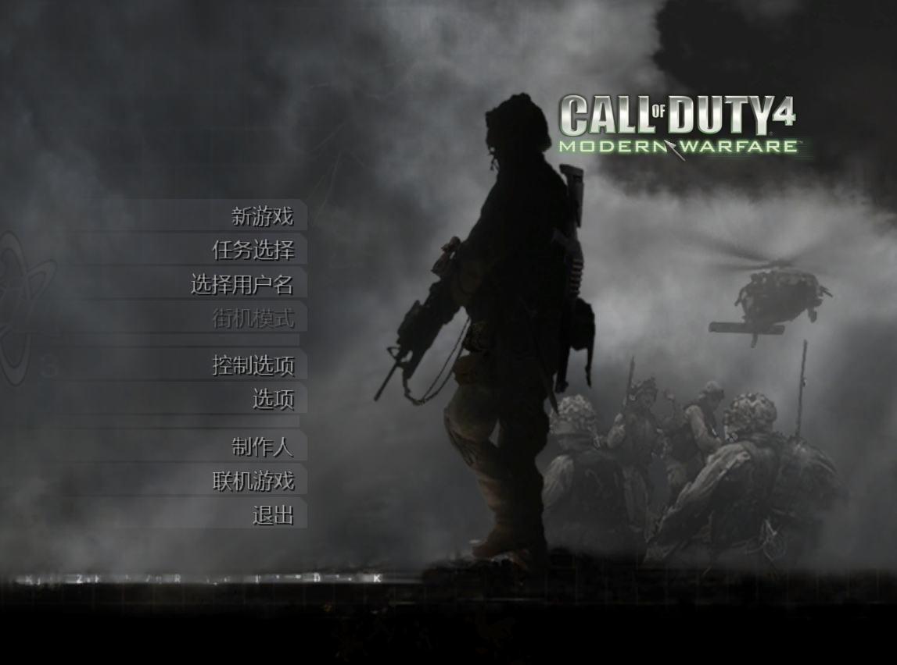

# COD4:MW 中文补丁现代化跨平台安装器



**声明：本安装器是基于2009年游侠汉化组原汉化补丁成果的现代化版本，所有汉化数据均直接复用自2009年原版发行包，未做任何修改。本安装器仅将原版的 decompressor/replace/compressor 私有 EXE 工具链替换为跨平台的 Python zlib 标准库实现。**

基于游侠网 / 使命召唤中文站 2009 年汉化补丁制作的**纯 Python 现代化安装器**，兼容 Windows、Linux（含 SteamOS）及 macOS。

## 原汉化组人员名单（2009）

| 职责 | 人员 |
|---|---|
| 总监 | lijingxing（游侠汉化组） |
| 技术 | 070（游侠汉化组兼使命召唤中文站）、sunwayking（游侠汉化组）、falser |
| 翻译 | digmouse、kb1999、Panzerwillow、softboy（游侠汉化组） |
| 测试 | Happymars、Loper、speedypanda、arj1984、杜达耶夫、wblllqbnb3、viscap、237252994、momo、unlucky（使命召唤中文站测试组）；digmouse、klarc（游侠汉化组） |
| 鸣谢 | 中国主视角站（图标汉化包）、aintnomeinteam（遗失CSV文件） |
| **新版安装脚本** | **David** |

## 与原版的区别

| 特性 | 原版 (2009) | 本版 (modern) |
|---|---|---|
| 运行平台 | 仅限 Windows | **Windows / Linux / SteamOS / macOS** |
| 技术依赖 | 3 个私有二进制 EXE | **纯 Python 3 标准库** |
| 附带推广 | 有 | **无** |
| 防病毒误报 | 老旧 EXE 常被误报 | **开源脚本，零误报** |
| 启动图替换 | 强制替换 BMP | **手动选择，自动匹配 BMP/PNG** |

> **修复老补丁报错**：原版补丁在某些系统上安装后游戏会报错 **"Couldn't load image"**。本安装器已修复该问题，已在 **Windows 11** 上完整测试通过。

## 技术原理

原版使用 2009 年的私有二进制工具链：
1. `decompressor.exe` —— 解压 `.ff` FastFile（已确认使用 zlib 1.2.3）
2. `replace.exe` —— 在 dump 的十六进制偏移处写入 patch payload
3. `compressor.exe` —— 用 zlib 重新压缩

本版完全替代为：**Python `zlib` 模块** 做解压/压缩，纯字节操作做偏移写入。patch payload（`.bin` 文件）全部复用原版汉化数据，汉化效果**100% 一致**。

## 安装要求

- **Python 3.6 或更高版本**
- **原版 COD4 已升级到 1.7 版本**（完整光盘版安装）
- **约 3GB 磁盘剩余空间**（用于备份和临时文件）

> SteamOS / Linux 通常已预装 Python 3。Windows 用户如未安装，可从 [python.org](https://python.org) 下载。

## 快速开始（推荐：双击启动）

### 下载补丁

1. 在本仓库页面点击绿色的 **<> Code** 按钮
2. 点击 **Download ZIP**
3. 将下载的 `cod4-cn-patch-main.zip` 在 COD4 **游戏根目录** 解压

### Windows

1. 打开解压出的 `cod4-cn-patch-main/` 文件夹
2. 将其中的 `Windows双击安装中文补丁.bat`、`cod4_cn_patch.py` 和 `patches/` 放到 COD4 **游戏根目录**
3. **双击 `Windows双击安装中文补丁.bat`**
4. 在弹出的 CMD 窗口中查看原汉化组人员名单，然后选择菜单操作

### macOS

1. 打开解压出的 `cod4-cn-patch-main/` 文件夹
2. 将其中的 `macOS双击安装中文补丁.command`、`cod4_cn_patch.py` 和 `patches/` 放到 COD4 **游戏根目录**
3. **双击 `macOS双击安装中文补丁.command`**
4. 在终端窗口中选择菜单操作

> 首次运行时系统可能提示"无法打开"，请前往 **系统设置 → 隐私与安全性** 中允许，或按住 Control 键点按文件选择"打开"。

### Linux / SteamOS

1. 打开解压出的 `cod4-cn-patch-main/` 文件夹
2. 将其中的 `Linux双击安装中文补丁.sh`、`cod4_cn_patch.py` 和 `patches/` 放到 COD4 **游戏根目录**
3. **双击 `Linux双击安装中文补丁.sh`**（取决于桌面环境，或右键选择"作为程序运行"）
4. 在终端窗口中选择菜单操作

> Steam Deck 桌面模式下，在文件管理器 (Dolphin) 中右键 `.sh` 文件即可看到 "Run in Konsole" 选项。

## 安装过程预览

选择 **[I] 安装中文补丁** 后，首先扫描游戏目录并提示：

```
  检测到游戏启动画面: cod.png
  是否替换为中文版？
  [Y] 是 — 使用中文启动图（推荐）
  [N] 否 — 保留原版启动图

  请选择 [Y/N] (默认 Y):
```

然后显示阶段进度：

```
[*] 发现 22 个 .ff 文件需要汉化，共 145 处 patch

[1/4] 替换基础文件...
  [>] 已替换: cod.bmp
  [>] 已替换: localization.txt
  [OK] 完成

[2/4] 安装中文字体资源...
  [>] 已安装: localized_chinese_iw15.iwd
  [>] 已停用: localized_english_iw15.iwd -> localized_english_iw15.iwd.disabled
  [OK] 完成

[3/4] 准备 22 个游戏数据文件...
  [>] 已复制: zone/english/common.ff
  ...
  [OK] 完成

[4/4] 写入汉化补丁 (共 22 个文件)...
  [#-----------------------------]   4.5% (1/22) ac130.ff           199KB -> 200KB  (1p)
  [##----------------------------]   9.1% (2/22) airlift.ff         199KB -> 200KB  (8p)
  ...
  [##############################] 100.0% (22/22) village_defend.ff 199KB -> 200KB  (10p)
  [OK] 完成

============================================================
  [OK] 安装完成！游戏已切换为中文版。
============================================================
```

## 文件结构

```
Call of Duty 4/
├── iw3sp.exe              ← 游戏主程序
├── main/
├── zone/
├── Windows双击安装中文补丁.bat     ← Windows 双击启动器
├── macOS双击安装中文补丁.command   ← macOS 双击启动器
├── Linux双击安装中文补丁.sh         ← Linux/SteamOS 双击启动器
├── cod4_cn_patch.py       ← 核心安装器（纯 Python）
├── README.md
└── patches/
    ├── cod1.bmp           ← 中文启动图 (原版)
    ├── cod1.png           ← 中文启动图 (转换格式)
    ├── localization.cn    ← 中文语言配置
    ├── main/
    │   └── localized_chinese_iw15.iwd   ← 中文字体纹理
    └── zone/
        └── chinese/
            └── *.bin      ← 145 个 .ff patch payload
```

## 命令行使用（高级用户）

如果习惯命令行，也可以直接运行 Python 脚本：

```bash
# 进入交互式菜单（等同于双击启动，会显示人员名单和菜单）
python3 cod4_cn_patch.py

# 直接安装（默认替换启动图）
python3 cod4_cn_patch.py install

# 直接卸载
python3 cod4_cn_patch.py uninstall

# 查看状态
python3 cod4_cn_patch.py status

# 指定游戏目录
python3 cod4_cn_patch.py install --game-dir ~/Games/COD4
```

## 安全机制

- **原子备份**：任何文件被修改前都会自动复制到 `.cod4cn_bak/`
- **失败回滚**：安装过程中任何步骤出错，自动撤销已完成的操作
- **重复安装保护**：检测到 `.cod4cn_bak/` 存在时会阻止重复安装，避免备份嵌套
- **偏移校验**：每个 patch 写入前检查偏移是否在 dump 范围内，防止溢出
- **进度可见**：每个 .ff 文件处理时实时显示百分比、文件大小变化和 patch 数量
- **手动选择是否替换启动图**：安装时扫描游戏目录中现有的启动图格式，询问用户是否替换。预置了 `cod1.bmp`（Windows）和 `cod1.png`（macOS/SteamOS）两种格式，无需在目标系统上安装图像转换工具
- **可选跳过启动图**：用户可选择 [N] 保留原版启动图，仅汉化文字和字体资源

## 已知限制

1. **联机兼容性**：汉化修改了 `.ff` 文件的哈希值，部分开启文件校验（`sv_pure`）的多人服务器可能拒绝连接。建议仅用于单人战役或局域网对战。
2. **高压硬盘版不确定有效**：本补丁基于完整光盘版设计，对网络上流传的高压精简版兼容性未知。
3. **`.ff` 压缩比差异**：重新压缩后的 `.ff` 文件大小可能与原版略有不同（zlib 默认级别），但不影响游戏读取。

## 致谢

汉化内容版权归原汉化组所有：
- 总监：lijingxing（游侠汉化组）
- 技术：070、sunwayking、falser
- 翻译：digmouse、kb1999、Panzerwillow、softboy
- 测试：Happymars、Loper、speedypanda 等
- 来源：[游侠网](http://www.ali213.net) / [使命召唤中文站](http://www.codchina.net)

本安装器仅提供**现代化跨平台封装**，未修改任何汉化数据内容。
